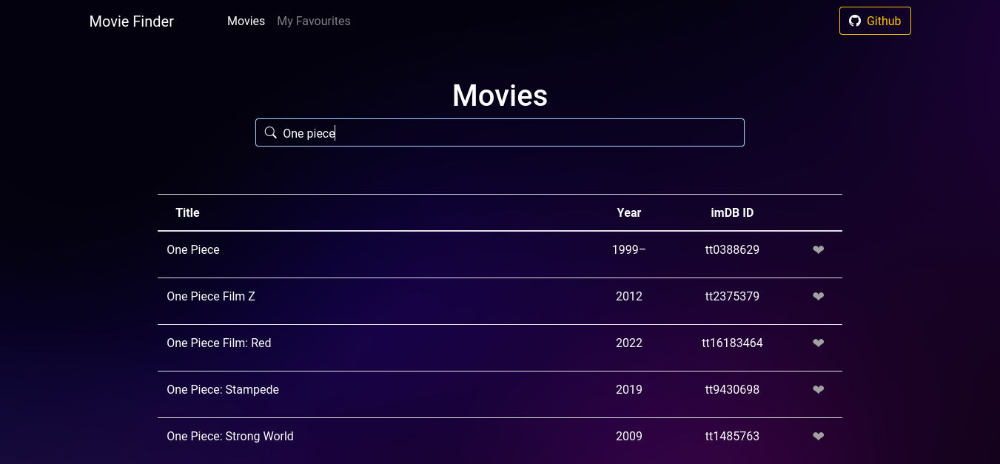

# React Movie Finder App

A Simple Movie Application using React JS ,allows the user to search and filter movies they want  from the OMDB API

This is a responsive web application for viewing in both Mobile and Desktop.

## Demo

Check out a live demo and try it for yourself: [demo](https://movie-finder-beta.vercel.app/)

## Screenshots

 ## Run these Commands:
 These instructions will get you a copy of the project up and running on your local machine for development and testing purposes.
### Step 1:Clone the repository
     git clone https://github.com/fjrpambudhi74/react-movies.git
### step 2:Navigate to the clone
     cd your_path/React-Movie-App
#### Step 3: Install Node.js dependencies:
     npm install
#### Step 4: Set your api key environment variable(.env). Get an api key from  [OMDB API](https://www.omdbapi.com/)
     REACT_APP_API_KEY=your_api_key
#### Step 5:
     npm  start

## Built with

- [React](https://reactjs.org/)
- [react-router-dom](https://reactrouter.com/)
- [bootstrap](https://getbootstrap.com/)
- [react-bootstrap](https://react-bootstrap.github.io/)
- [bootstrap-icon](https://icons.getbootstrap.com/)
- [react-toastify](https://github.com/fkhadra/react-toastify)
- [ESLint](https://eslint.org/)
- [Prettier](https://prettier.io/)

##
Copyright (c) 2022 Fajar Pambudhi
